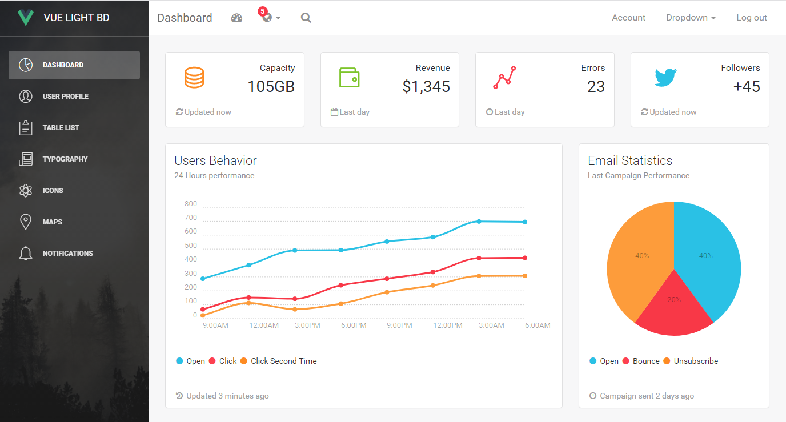

# [Vue Light Bootstrap Dashboard](https://github.com/cristijora/vue-light-bootstrap-dashboard) [![version][version-badge]][CHANGELOG] [![license][license-badge]][LICENSE]

> Admin dashboard based on paper dashboard UI template + vue-router

This project is a vue version of [Light bootstrap dashboard](https://www.creative-tim.com/product/light-bootstrap-dashboard)
designed for vue js.The dashboard includes vue-router and vuex

Check the [Live Demo here](https://github.com/cristijora/vue-light-bootstrap-dashboard).

## Documentation (Work in Progress)
Link to [Documentation](https://cristijora.github.io/vue-light-bootstrap-dashboard/documentation/#/buttons)

## Build Setup

### install dependencies
`npm install`
### serve with hot reload at localhost:8080
`npm run dev`
### build for production with minification
`npm run build`
### run unit tests
`npm run unit`
### run and watch unit tests
`npm run unit:watch`

## Contribution guide
* `npm install` or `yarn install`
* Please don't use jQuery or jQuery based plugins since there are many pure Vue alternatives

For detailed explanation on how things work, checkout the [guide](http://vuejs-templates.github.io/webpack/) and [docs for vue-loader](http://vuejs.github.io/vue-loader).

[CHANGELOG]: ./CHANGELOG.md
[LICENSE]: ./LICENSE.md
[version-badge]: https://img.shields.io/badge/version-1.0.0-blue.svg
[license-badge]: https://img.shields.io/badge/license-MIT-blue.svg
